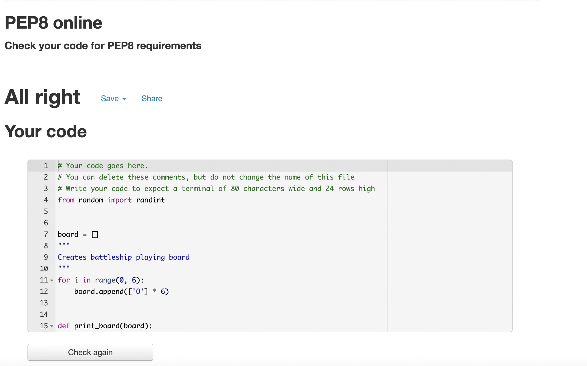

# Battleships Arcade

Battleships arcade is a Python terminal game, which runs on Heroku.

Users can try to pinpoint the battleship on the board and sink it before the turn tally is over. The ship occupies 1 point on the grid.

## How to play

You can refer to the rules of the game on here https://en.wikipedia.org/wiki/Battleship_(game)

- In this version the player attempts to find the computers hidden Battleship.
- The player has 5 chances to find the hidden Battleship.
- If the player misses the Battleship it will be marked with a '-'.
- If the player hits the Battleship it will be marked with a 'X'.
- If the player hits the Battleship the game will indicate they have won.
- If the player runs out of turns it will indicate they have lost.

## Features

### Existing features

- Ship is randomly generated on the board and the player will be unable to see this.

- Accepts user coordinates input.
- Shows turn tally.

- You cannot input coordinates outside of the playable area.
- You cannot input the same choice twie.

- Indicate when the game is over

### Future features

- Add additional ships.
- Allow oppenent to attack user ships.
- Increase the ship size.

## Data Model

I decided to use a board class for the game, in this instance there is one board used to attack the computer ships.

The board stores the data of the board size, ship location and user coordinate choices.

## Testing

- Passed code through PEP8 with no errors.

## Validator testing

- http://pep8online.com/checkresult

## Deployment

This project was deployed using Code Institute's mock terminal for Heroku.

### Steps for deployment
- Fork or clone this repository
- Create a new Heroku app
- Set the buildpacks to Python and NodeJS in that order
- Link the Heroku app to the repository
- Click on Deploy

## Credits
- Code institute for deployment terminal
- Wikipedia for details of battleship game
- Youtuber "Clever programmer" for his great instructional videos
