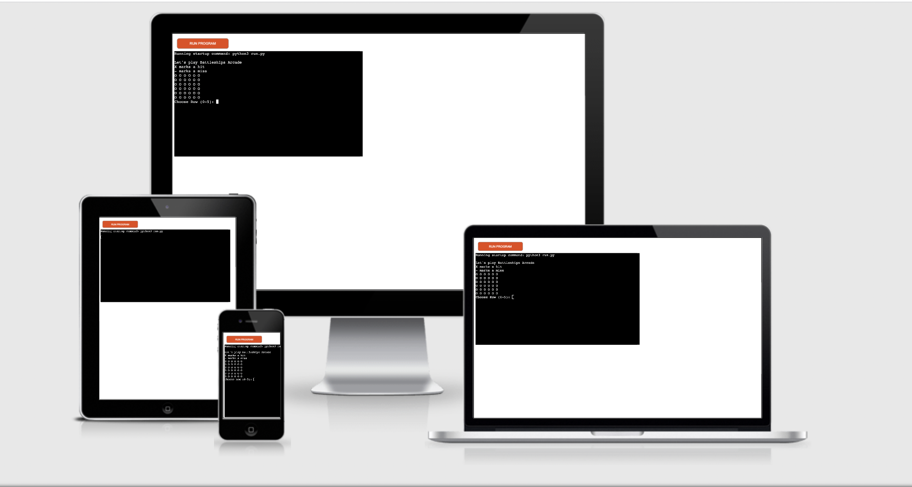
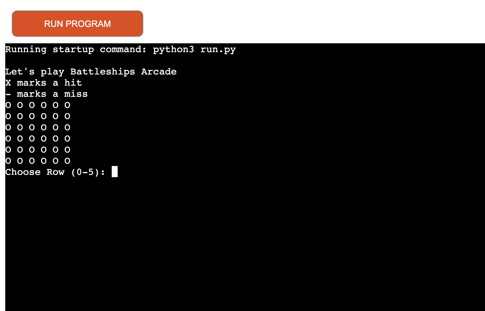
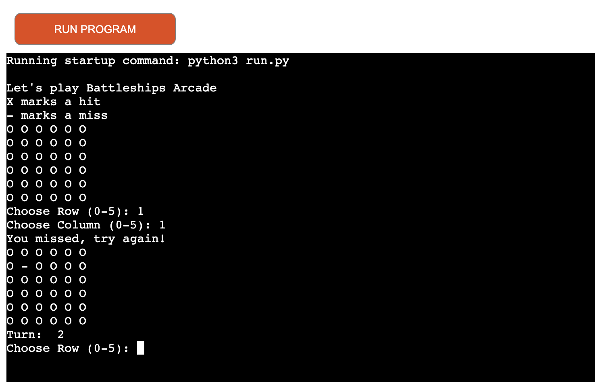
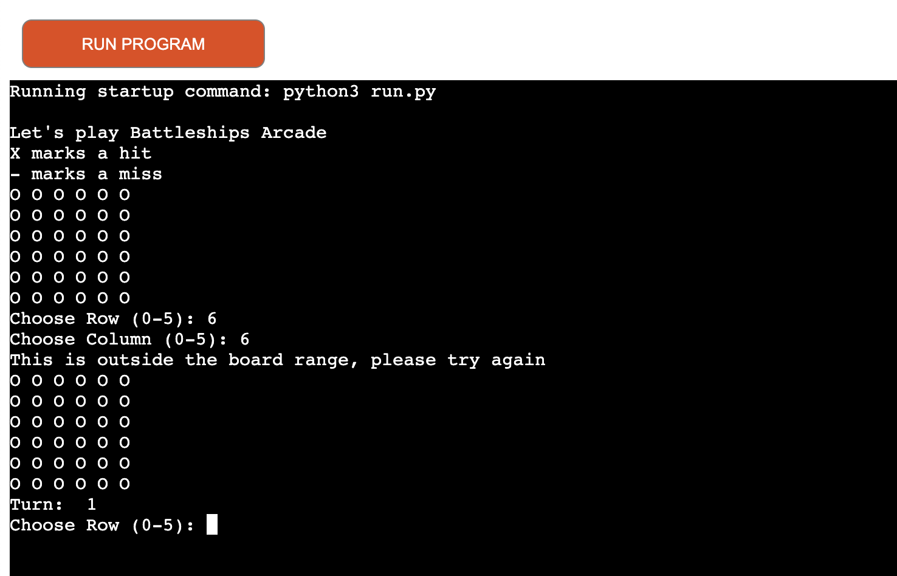
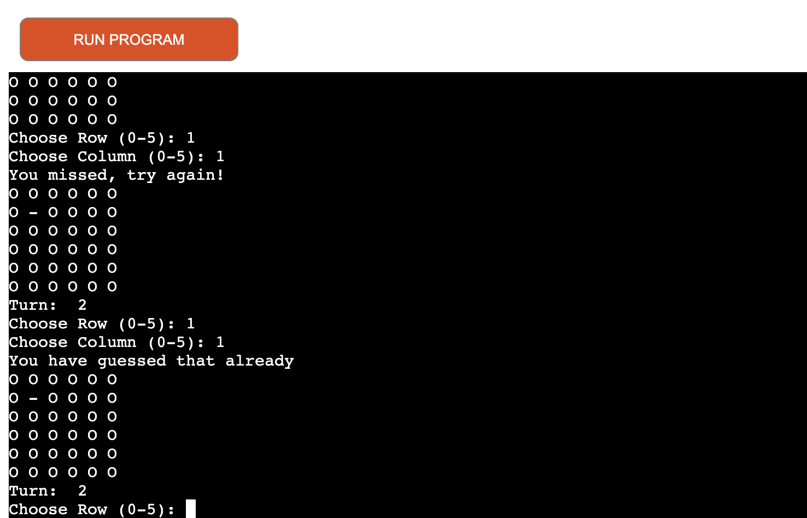
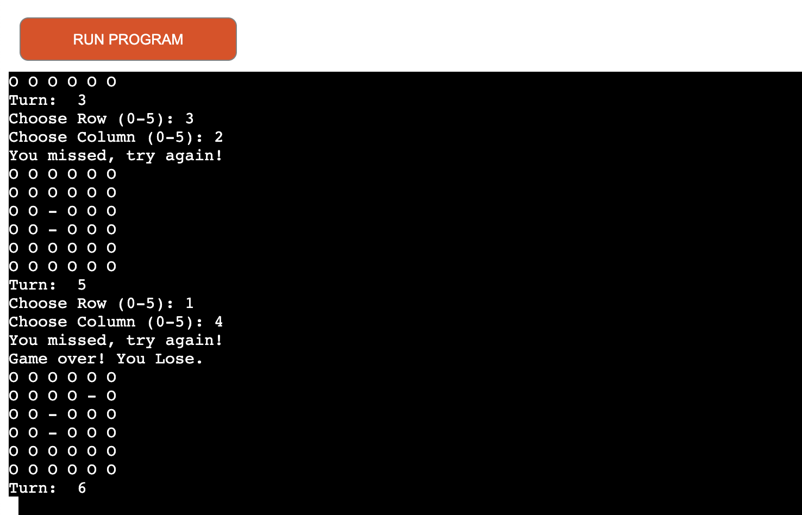

# Battleships Arcade

Battleships arcade is a Python terminal game, which runs on Heroku.

Users can try to pinpoint the battleship on the board and sink it before the turn tally is over. The ship occupies 1 point on the grid.

## How to play

You can refer to the rules of the game on here https://en.wikipedia.org/wiki/Battleship_(game)

- In this version the player attempts to find the computers hidden Battleship.
- The player has 5 chances to find the hidden Battleship.
- If the player misses the Battleship it will be marked with a '-'.
- If the player hits the Battleship it will be marked with a 'X'.
- If the player hits the Battleship the game will indicate they have won.
- If the player runs out of turns it will indicate they have lost.

## Features

### Existing features

- Ship is randomly generated on the board and the player will be unable to see this.

- Accepts user coordinates input.
- Shows turn tally.

- You cannot input coordinates outside of the playable area.
- You cannot input the same choice twie.

- Indicate when the game is over

